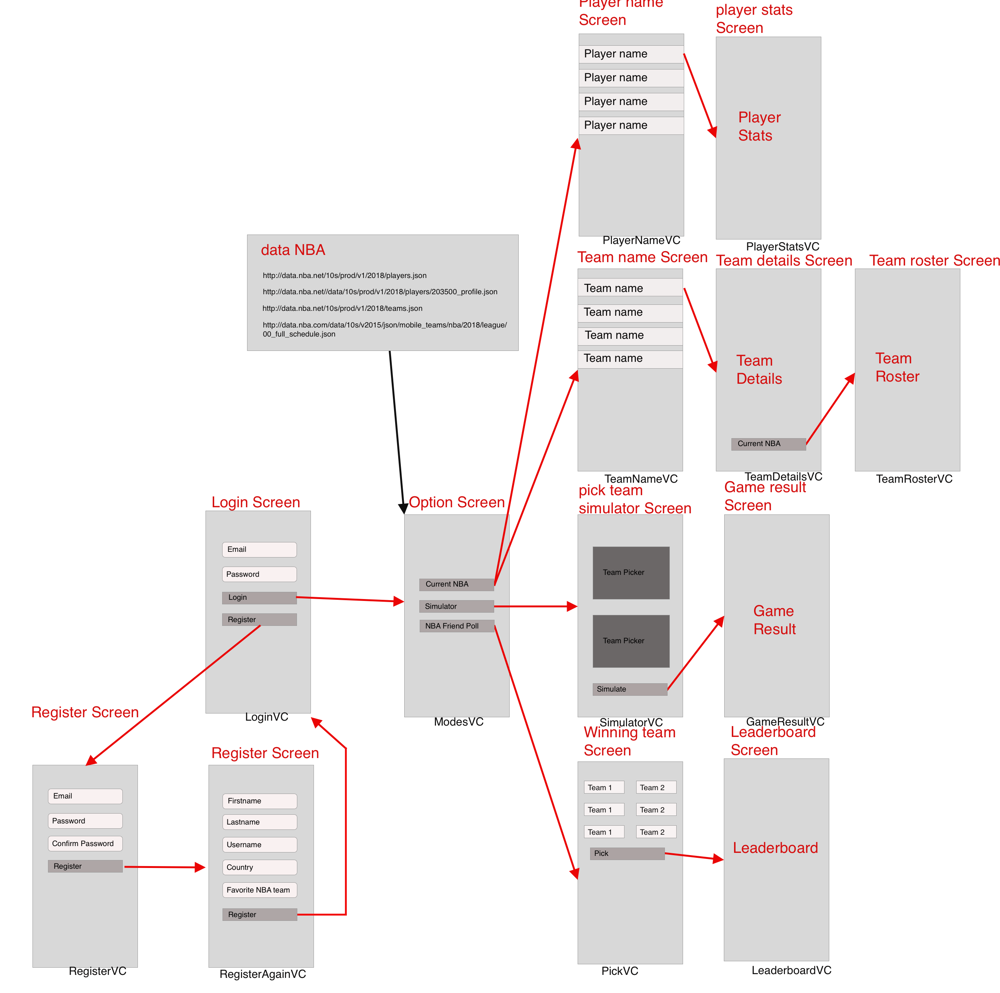

# Project-proposal
### Problem statement
You're an NBA fan and like to watch some games once in a while. As a NBA "Expert" you probably have a clue which team is going to win each night. Since the NBA has around 2.460 regular seasons games in a timespan of 6 months it could be fun to hold a competition with your friends on who can guess the winner the most. But at this moment there isn't an app that offers this. 
You can also have a pretty good idea on who is going to win, but are not sure about it. For this reason a simulator will be available to simulate the end score of that particulair game.

### Proposal
As said before, a simulator will be made so users can simulate games with up to date data. For this a NBA Schedule API will be used.

To see which player is better than the other player, ratings are going to be made for each player to compare them. For this a NBA Player Stats API will be used with up to date states, alongside a NBA Player API, to show all current NBA Players. 
With these ratings certain offensive, defensive and overal ratings can be designed for each team. These team ratings, along side the home playing team factor, will determine the outcome of the simulator. To get each up to date NBA Team and their specifications, a NBA Team API will be used. 

Now all the tools are there for NBA experts and rookies to participate in the NBA Guessed Games Leaderboard. Players who signed up can enter the worldwide leaderboard, and create own leaderboards to compete with friends! When creating a new leaderboard, you can set a goal/award for the one who has the most correct games guessed. Each correct game will be rewarded with 1 point. When the play-offs start this will double the rewarded point each round the play-offs progresses. 

### Minimum
All of the above is the minimum that the app is required to do

### Prerequisites
Players: http://data.nba.net/10s/prod/v1/2018/players.json

Player stats: http://data.nba.net//data/10s/prod/v1/2018/players/203500_profile.json

Teams: http://data.nba.net/10s/prod/v1/2018/teams.json

Schedule/uitslagen: http://data.nba.com/data/10s/v2015/json/mobile_teams/nba/2018/league/00_full_schedule.json 

Not sure if i'm going to use Firebase or mySQL for user register/login

Some apps that have some simularities are:
- NBA 2k19 

Hardest part will be to get all the data in the correct places

