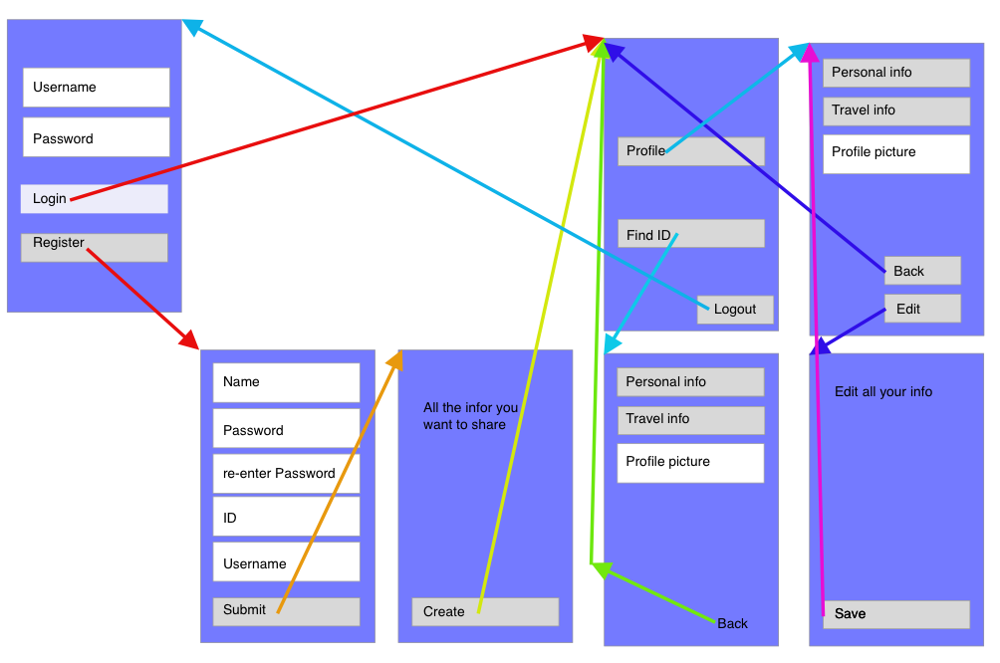

# Project-proposal
### Problem statement
So you're in the middle of nowhere in a country like Nepal, and you meet this funny group from Estonia. After a while you find out they are, just like you, traveling to Beijing next. Great! You should do something together while you're there, but what's are current methods of exchanging contacts with a person? Through a phone, pen/paper? But with a whole group that is a waste of time, and inconvenient since everybody needs your number, etc.
### Proposal
Well, soon to be there will be an app that will fix this problem, called TravelBook! In this app you sign up and give all the information you want to share with others. Information like: name, place you're from, languages you speak, email, phone number, etc. 

When you planned your trip from home, and are ready to go you can enter you travel details so others can see them as well! Travel details like: countries you're visiting, an agenda which tells your location for each day, hotels/motels/hostels you're staying at, and lasty the things/places you want to visit or do while you are at a specific location.

Sounds good doesn't it? But how do you add a person, and do you need internet connection for it? Well first every registered person has an unique ID, and by sharing that with another person who has the app, that person will retrieve all the information you put on your profile! If the person doesn't have an internet connection, the app will remember the ID you entered and as soon as there is an internet connection it will retrieve your information!

If in any case the person wasn't paying attention and missed the enormous rise of TravelBook, you can select an option to send an card/invitation via Whattapp/Facebook/email/etc. If you have an internet connection, that person can open a webpape through the link and see your profile.

