# NBA Simulator

## Screenshot's of the app
If the user isn't logged in it will see the login screen
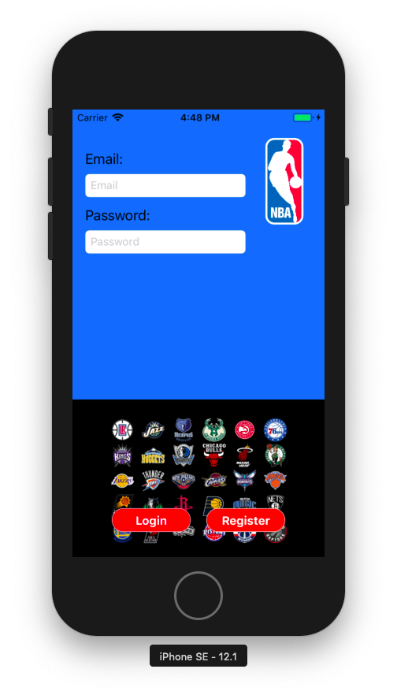

If the user doesn't have an account yet it can register
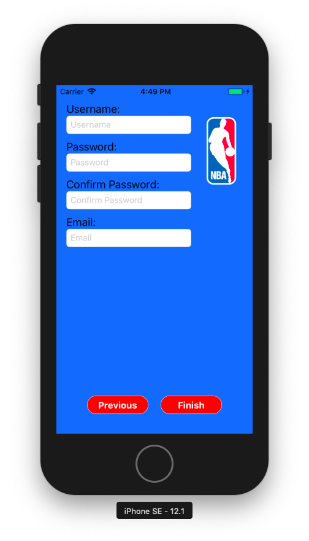

When logged in the API's are loaded and the user has to wait
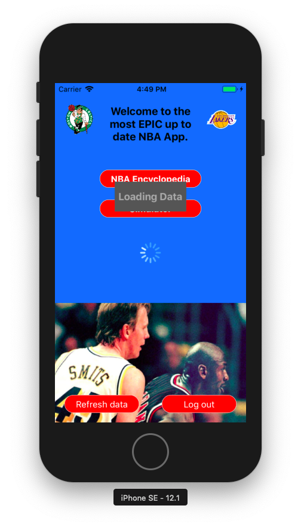

If the user just registered, logged in, or was already logged in it sees the menu which the options it can choose from. The user can logout or refresh the data (loading all the API's again)
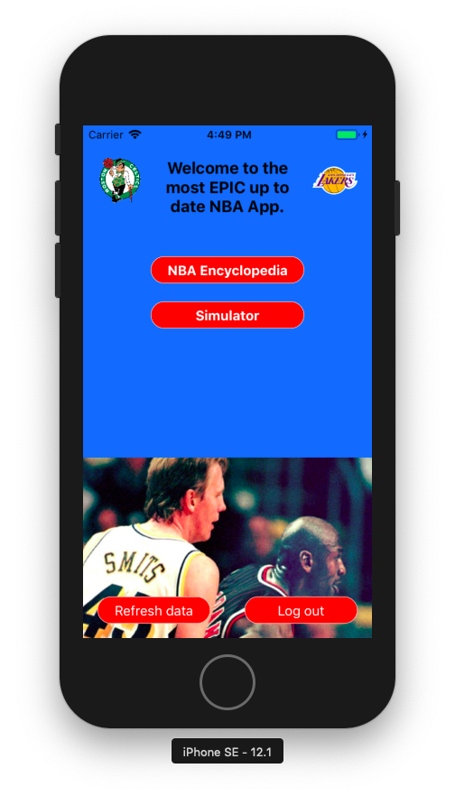

If NBA encyclopedia is selected the user will see a tableview with all the players
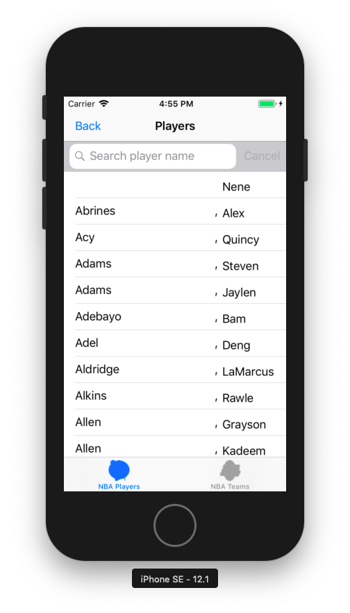

When the a player is clicked a view controller with the player details will pop-up
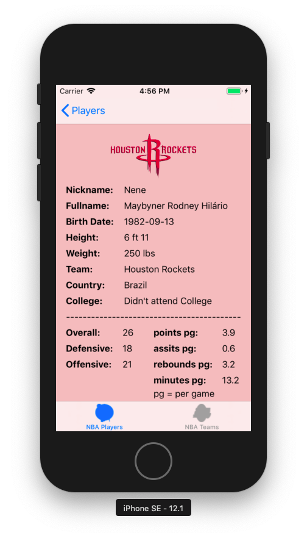

When the user switches to the team tableview it can see all the NBA teams
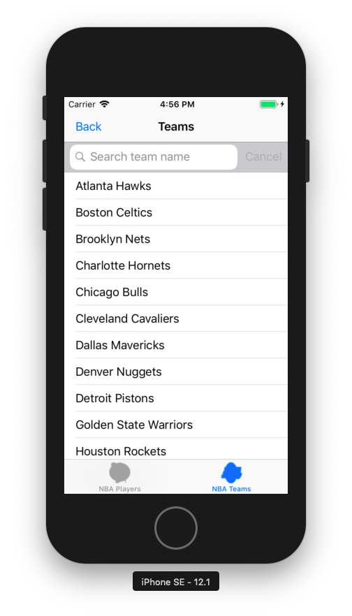

If the a team is clicked, it will see the team details 
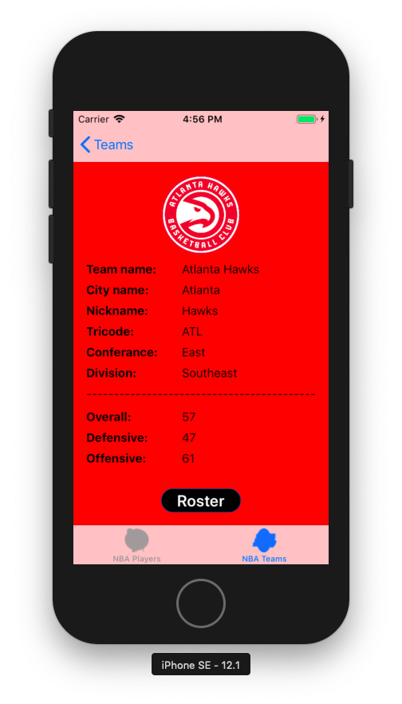

When the roster button is clicked the user sees all the players of that team
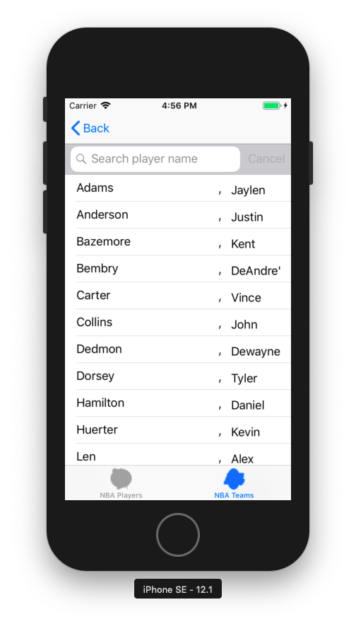

When a player is clicked the user will again see the player details
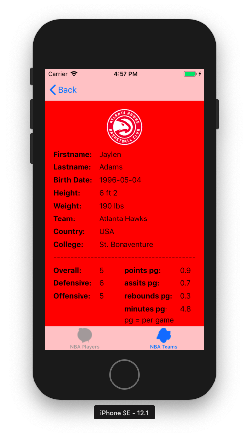

If the user goes back to the menu and selects simulator it will see a view controller in which the player can select two teams to play eachother. The result will depend on who is playing at home and away. 
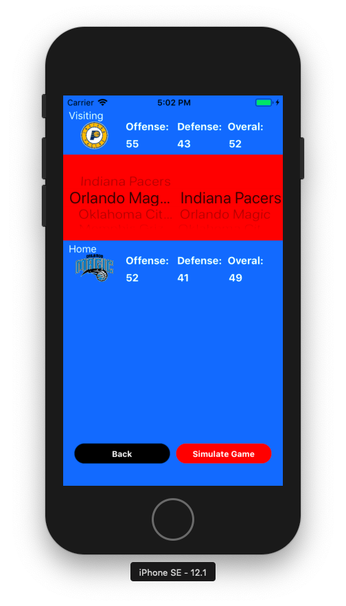

When the simulate button is pushed a alert shows for a couple of seconds indicating the game is being simulated right now
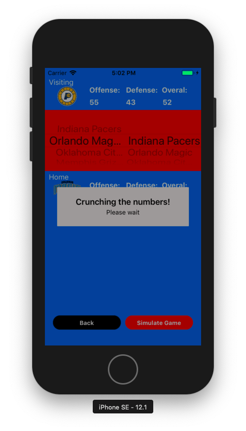

After that the user will see the game result. By pushing back the user goes back to the menu and by pushing the again button the player is directed back to the simulator view controller.
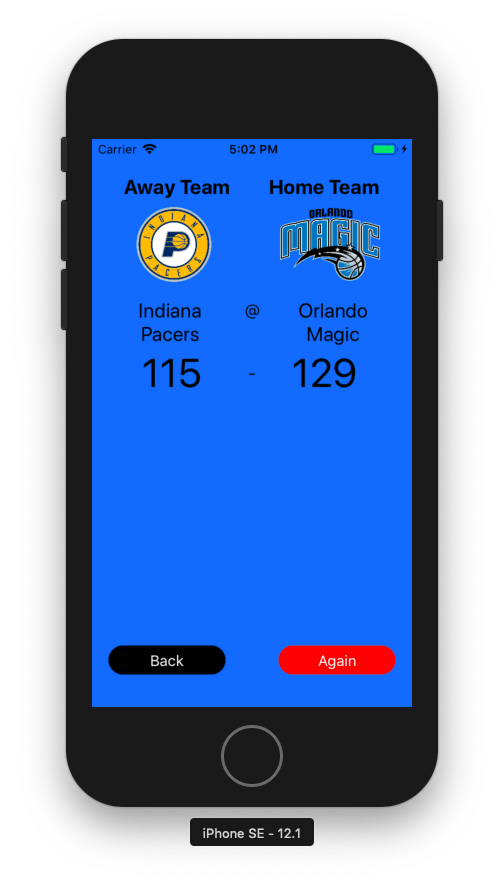

## The purpose of NBA Simulator
You're an NBA fan and like to watch some games once in a while. But as a NBA "Rookie" fan you probably have no clue which team is going to win each night and which player is on which team. This NBA app offers a clear list of all players and teams (including their rosters). For the people that aren't familiar with the players the game averages are shown (point per game, etc.), and for the users that arent familiar with basketball there are ratings of each player (offensive, defensive, and overal). These individual ratings combined with the minutes these players make, will result in team ratings. And these team ratings will be used to simulate games. A user can choose which teams play eachother. The reason for this simulator is:
- unfamiliar users can get an indication which team is more likely to win in reallife.
- familiar users can use this when a player is traded to a team and both teams haven't played eachother yet in reallife.

## Student
Brian van de Velde 

## Files

## Sources
In de docs folder there is a file named "AA-"
