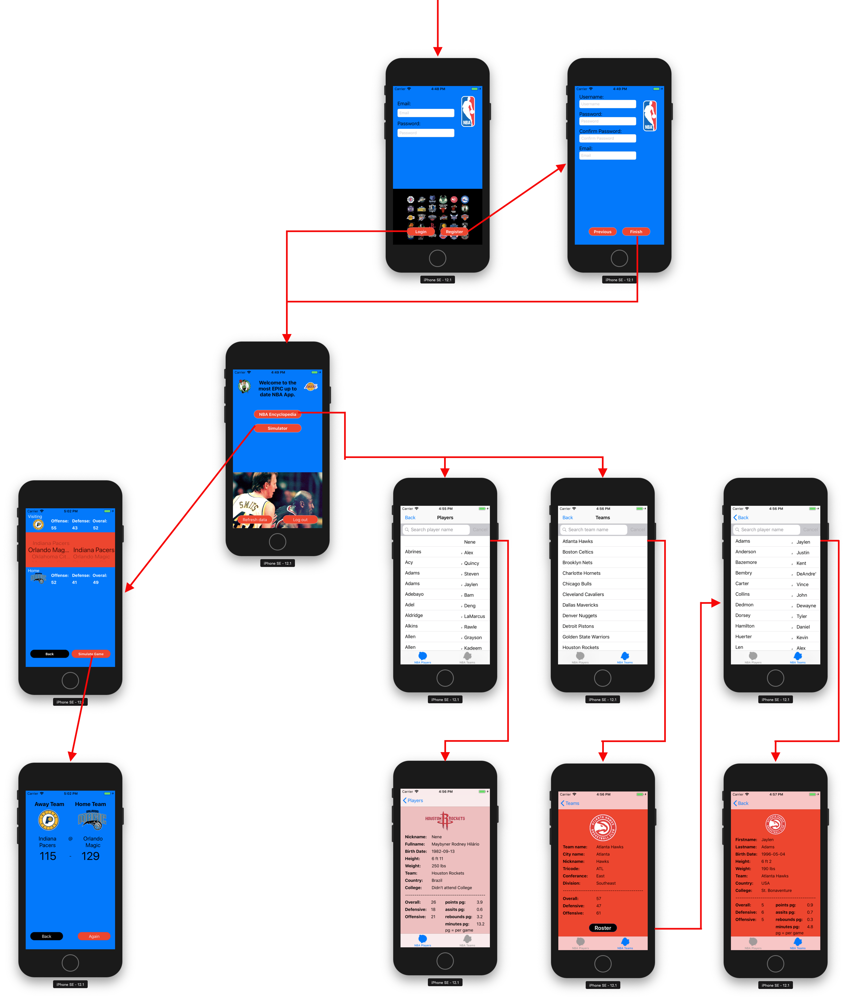

# NBA Simulator

## Short description
You're an NBA fan and like to watch some games once in a while. But you have no clue which team is going to win each night and which player is on which team. A user can look up all players, teams, and their rosters. To see which team is more likely to win there is a simulator where the user can select to teams to play eachother

## Technical design
All the way up in the report there is the app flow visualized.

Structure of the app
* The initial view controller is [loginVC](https://github.com/snellebribo98/NBA-Simulator/blob/master/NBA_Score/Login%20%26%20Register/LoginVC.swift) where the user can login or click to register. This view controller is helped by standard Google Firebase Authentication. If the user clicks on the register button it will be directe to [NexRegisterVC](https://github.com/snellebribo98/NBA-Simulator/blob/master/NBA_Score/Login%20%26%20Register/NexRegisterVC.swift) where the user will sign-up, which is also helped by standard Google Firebase Authentication. If the user was already logged in, logged in when the app started, or signed up it will be directed to [modesVC](https://github.com/snellebribo98/NBA-Simulator/blob/master/NBA_Score/modesVC.swift). In this view controller all the data will be loaded from the API's. This will take a couple of seconds and if the user would decide to click on any of the button before all the data is loaded, the app will crash. This is why the first couple of seconds this view controller is showed the user can't interact with the screen. After the data is loaded there are a couple of options
  - Click the NBA encyclopedia button: This button will direct you to a tab bar controller where each tab is embedded in a navigation controller. In the first tableview [PlayerTV](https://github.com/snellebribo98/NBA-Simulator/blob/master/NBA_Score/Current%20NBA/PlayerTV.swift) is shown where all the players are shown by last- and firstname. The cells are supported by [PlayerCell](https://github.com/snellebribo98/NBA-Simulator/blob/master/NBA_Score/Current%20NBA/PlayerCell.swift). When the user clicks on a player cell it will be directed to [PlayerDetailVC](https://github.com/snellebribo98/NBA-Simulator/blob/master/NBA_Score/Current%20NBA/PlayerDetailVC.swift) where are the details of that player is shown. In the second tableview [TeamTV](https://github.com/snellebribo98/NBA-Simulator/blob/master/NBA_Score/Current%20NBA/TeamTV.swift) is shown where there is a tableview with all the teams, which is supported by [TeamCell](https://github.com/snellebribo98/NBA-Simulator/blob/master/NBA_Score/Current%20NBA/TeamCell.swift). When the user clicks on one cell the team of that cell will be shown in [TeamDetailVC](https://github.com/snellebribo98/NBA-Simulator/blob/master/NBA_Score/Current%20NBA/TeamDetailVC.swift). In this view controller there is a roster button and if that is clicked the user is directed to the [RosterTV](https://github.com/snellebribo98/NBA-Simulator/blob/master/NBA_Score/Current%20NBA/RosterTV.swift) tableview where all the players of that team are shown, and is supported by [RosterCell](https://github.com/snellebribo98/NBA-Simulator/blob/master/NBA_Score/Current%20NBA/RosterCell.swift). When the user clicks on one of the player cells it is again directed to [PlayerDetailVC](https://github.com/snellebribo98/NBA-Simulator/blob/master/NBA_Score/Current%20NBA/PlayerDetailVC.swift)
  - Click the simulator button: the user will be directed to [SimulatorVC](https://github.com/snellebribo98/NBA-Simulator/blob/master/NBA_Score/Simulator/SimulatorVC.swift) where there is a picker with two components. The user can select two team in this view controller and then either click on the back button which directs the user to [modesVC](https://github.com/snellebribo98/NBA-Simulator/blob/master/NBA_Score/modesVC.swift), or click the simulate button which will direct the user to [SimulatorResultVC](https://github.com/snellebribo98/NBA-Simulator/blob/master/NBA_Score/Simulator/SimulatorResultVC.swift). In this view controller the result of the simulated game is shown. Here the user can click on back to go to [modesVC](https://github.com/snellebribo98/NBA-Simulator/blob/master/NBA_Score/modesVC.swift), or click on again to go to [SimulatorVC](https://github.com/snellebribo98/NBA-Simulator/blob/master/NBA_Score/Simulator/SimulatorVC.swift) 
  - Click the refresh button: All the data will be loaded again
  - Click the logout button: The user will logout and is directed to [loginVC](https://github.com/snellebribo98/NBA-Simulator/blob/master/NBA_Score/Login%20%26%20Register/LoginVC.swift)
* The API's are loaded with the help of the following structs:
  - [NBAPlayersStruct](https://github.com/snellebribo98/NBA-Simulator/blob/master/NBA_Score/structs/NBAPlayersStruct.swift)
  - [PlayerStruct](https://github.com/snellebribo98/NBA-Simulator/blob/master/NBA_Score/structs/PlayerStruct.swift)
  - [TeamDetailsStruct](https://github.com/snellebribo98/NBA-Simulator/blob/master/NBA_Score/structs/TeamDetailsStruct.swift)
  - How the data works: player need a rating and with that rating and their minutes the team rating can be determined (which arent in the API's). These ratings are needed in [PlayerDetailVC](https://github.com/snellebribo98/NBA-Simulator/blob/master/NBA_Score/Current%20NBA/PlayerDetailVC.swift), [TeamDetailVC](https://github.com/snellebribo98/NBA-Simulator/blob/master/NBA_Score/Current%20NBA/TeamDetailVC.swift), and [SimulatorVC](https://github.com/snellebribo98/NBA-Simulator/blob/master/NBA_Score/Simulator/SimulatorVC.swift). To calculate them in each view would be inefficient. So it is done while loaded in the struct (all data is loaded in [modesVC](https://github.com/snellebribo98/NBA-Simulator/blob/master/NBA_Score/modesVC.swift)). So in [NBAPlayersStruct](https://github.com/snellebribo98/NBA-Simulator/blob/master/NBA_Score/structs/NBAPlayersStruct.swift) the players rating and rating in respect to minutes are determined and in [TeamDetailsStruct](https://github.com/snellebribo98/NBA-Simulator/blob/master/NBA_Score/structs/TeamDetailsStruct.swift) all the player ratings with respect to minutes of each team is determined. So now all data needed is loaded and can be directed to all controllers that need the data
* There is one extra class called [Buttons](https://github.com/snellebribo98/NBA-Simulator/blob/master/NBA_Score/Buttons.swift) that has a design purpose. When this class is assigned to a button it will make the corners round which looks better than the default buttons xcode has.

## Challenges
* The first challenge I had was which database to use for the login-in and register of a user. I thought of in the beginning of the project but decided to work on it when the app was finished. Throughout the weeks I heard a lot of people discussing the best way to do it. In the beginning of the project I tried to do it using FLASK, when I was building the app I decided to use MySQL, and when my app was done I finally decided to user Firebase. This is because I ran out of time and Firebase was the "easiest" to implement. 
* The second and easiest the hardest part about my app was loading the data. The one responsible for the API's that I used makes no sense to me. The first challenge was that when I loaded the teams my print showed I loaded way more teams than there are in the NBA. It turned out the API had NBA teams, summer league teams, etc. but I only needed the NBA teams. The second thing that was a challenge was that to get the player stats you needed the playerID in the url which was in the player API. To get all the stats I created a list with all the playerID's and looped through them all to get all the stats. So now I have three lists, teamlist, playerlist, and playerstatslist. This wasn't convenient since the playerstats should be connected to the player and the player to the team. This problem was solved by creating a dictionary with the teamID as key and the team information as the value. In the teamstruct I created a new list for the players. When the team was loaded all the teams were there but no players. When the players are loaded, I check what the teamID is of that player and place that player in the appropiate team. Now the team and players are connected but not the player with the player stats. In de player struct I created a stats list, and when the player stats are loaded it places those stats in the player with the same playerID. 
* The third challenge was the loading of the API's. When a user would click on any of the buttons while the data wasn't completely loaded yet the app would have a THREAD error and crashed. I solved this by giving making a completion method for the team API, player API, and finally player stats API. When the user goes to the modesVC it starts showing an activity indicator and disables user interaction, and when the player stas API is done loading the activity indicator stops and user interaction is enabled again. I created a list with all the playerID's and as soon as the number of loaded API's (stats) is the same as the playerID list (-1 because it starts at 0) it knows loading is completed.
* The fourth challenge was the picker in [SimulatorVC](https://github.com/snellebribo98/NBA-Simulator/blob/master/NBA_Score/Simulator/SimulatorVC.swift) wouldn't show the ratings and the team logo, and would only calculate the score ones and that was of the two teams that are shown when directed to the page. Since I use a double picker I had to make a update function where the labels and images are updated for the team that the picker is one and call the simulation function there. In the viewdidload function I had to call that function twice, one time for the home component and one time for the away component.
* The fifth challenge was to show a alert in [SimulatorVC](https://github.com/snellebribo98/NBA-Simulator/blob/master/NBA_Score/Simulator/SimulatorVC.swift) when the simulate button was pushed. First I had my simulate button perform the segue so when I wanted a alert and then go to the next vc my app crashed. I tried making the alert, sleep for 2 seconds, and then perform the segue but that didn't work either. By linking the segue between the two view controllers, and not between the button and view controller, I could make a completion in the alert. So when the button is pushed, the alert function is called and is shown, and when the alert is completed the segue is performed.

#### These last two challenges aren't that big or impressive but it took me a while to get it
* The sixth challenge was with the searchbars in [PlayerTV](https://github.com/snellebribo98/NBA-Simulator/blob/master/NBA_Score/Current%20NBA/PlayerTV.swift), [TeamTV](https://github.com/snellebribo98/NBA-Simulator/blob/master/NBA_Score/Current%20NBA/TeamTV.swift), and [RosterTV](https://github.com/snellebribo98/NBA-Simulator/blob/master/NBA_Score/Current%20NBA/RosterTV.swift). When a user looks a player/team up with the searchbar, then presses the cross in the searchbar and scrolls down, and clicks on a player cell, when the user returns the top of the tableview is shown (so the user is send all the way up again). By simply adding a cancel button this problem would be fixed, but for some reason when I called the cancelButtonPressed function, deleted the text in the searchbar and reloaded the table, only the players that were still visible after filtering were there and not the complete list. The reason this is a challenge (because this wasn't a really big thing or hard in particulair) was that cancelButtonPressed is a function that comes with a searchbar, and all the documention on internet said that this would be enough to have a good functioning cancel button. I found out the wrong list with players/teams was reloaded and made sure the right list was reloaded.
* One challenge was that I thought the struct should be identical to the API's, so all variables should be there otherwhise it wouldn't work, after a full day spending time on making the structs identical to the API's I found out that wasn't needed. 

## Make sure the document is complete and reflects the final state of the application. The document will be an important part of your grade.

